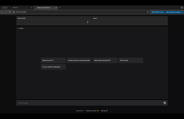

# The Simple Chatbot for testing and deploying LLM models

Test and deploy the latest LLM models in the fastest and most efficient way

## Prerequisites

- [Ollama](https://ollama.com/download) should be installed and running
- Pull a model to use with the library: `ollama pull <model>` e.g. `ollama pull deepseek-r1:1.5b`
  - See [Ollama.com](https://ollama.com/search) for more information on the models available.

## Install

```sh
conda create -n chatbot python=3.12 # create env
conda activate chatbot 
pip install poetry # install poetry
poetry install # install dependencies
```

## Run Chabot

```sh
python app.py # run app
```

```sh
* Running on local URL:  http://127.0.0.1:7860

To create a public link, set `share=True` in `launch()`.
```




### Full Video:
[Watch the full video here](https://drive.google.com/file/d/1iafzrrBuYnMo57-rnDP1Rya0cOg383uV/view?usp=sharing)